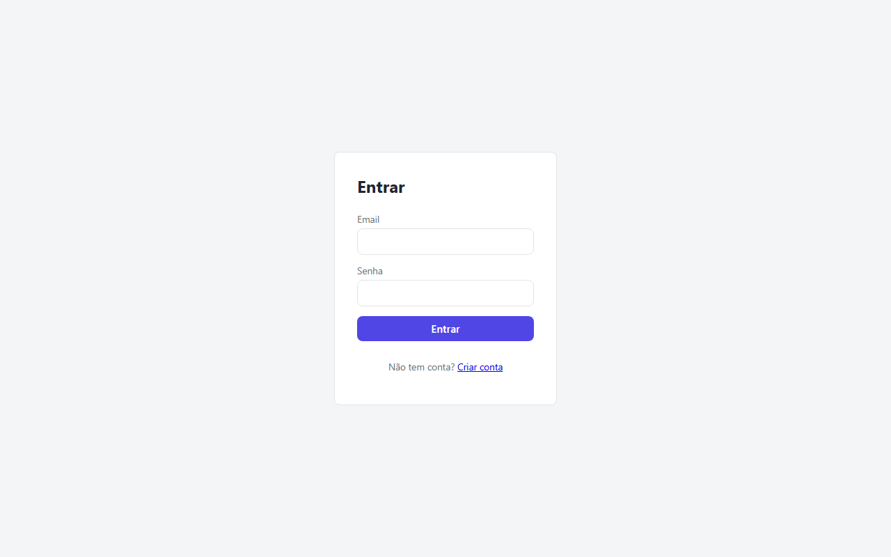
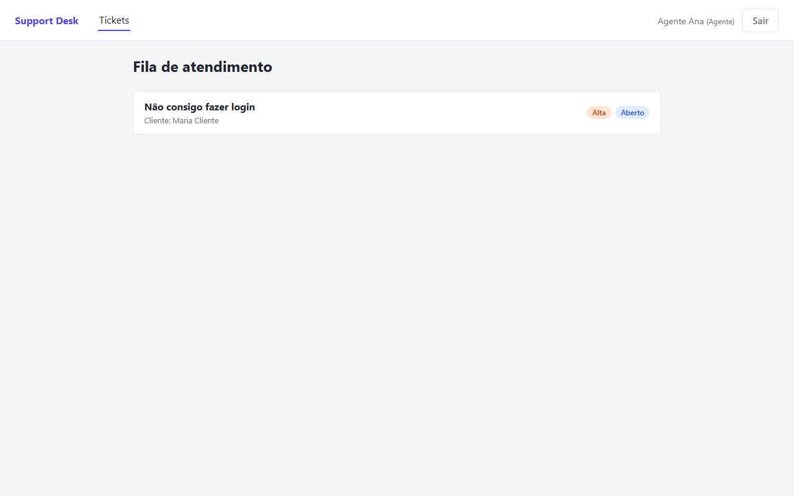
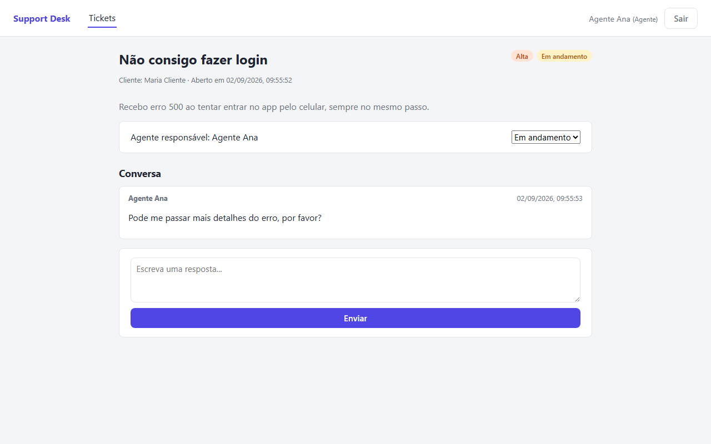
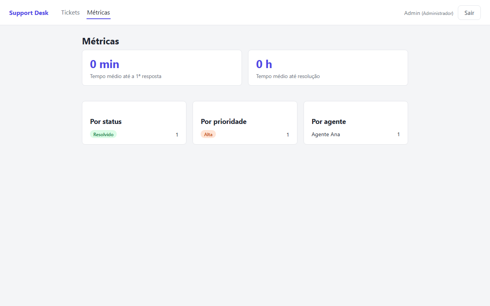

# Support Desk

[](https://github.com/Matheusedu01/support-desk/actions/workflows/ci.yml)

Sistema de tickets de suporte com três papéis (cliente, agente, administrador), construído para demonstrar autenticação, autorização baseada em papéis (RBAC), modelagem relacional e agregações de métricas — funcionalidades comuns em ferramentas internas B2B reais (Zendesk, Freshdesk, Jira Service Desk).

> Este projeto foi construído de forma incremental e documentada. Veja [GUIDE.md](./GUIDE.md) para o passo a passo completo: o que foi feito, por que, e para que serve cada decisão técnica — incluindo bugs reais encontrados (e corrigidos) no caminho.

## Screenshots

| Login | Fila de atendimento (agente) |
|---|---|
|  |  |

| Detalhe do ticket (conversa + status) | Métricas (admin) |
|---|---|
|  |  |

## Stack

- **Backend**: Node.js, TypeScript, Express, Prisma ORM, PostgreSQL, JWT
- **Frontend**: React, TypeScript, Vite, React Router

## Destaques técnicos

- **RBAC + autorização por objeto**: papel certo não é suficiente — cada ticket é checado individualmente contra quem está pedindo (proteção contra [BOLA](https://owasp.org/API-Security/editions/2023/en/0x11-t10/), a vulnerabilidade nº1 do OWASP API Security Top 10).
- **Métricas via SQL agregado**: tempo médio até primeira resposta e até resolução, calculados com subquery correlacionada direto no Postgres (`$queryRaw`), sem trazer dado bruto para a aplicação.
- **22 testes automatizados** (Vitest + Supertest) rodando em CI a cada push — unitários e de integração contra Postgres real.
- **Containerizado**: Dockerfiles multi-stage para backend e frontend, com migration do banco como job separado (evita corrida entre réplicas).

## Status

Completo e testado de ponta a ponta com PostgreSQL real: API, os 22 testes automatizados, e a UI no navegador (login, fila de tickets, métricas do admin). Deploy em nuvem é o único item ainda não feito, por decisão deliberada. Progresso detalhado no [GUIDE.md](./GUIDE.md#roadmap-o-que-vamos-construir-em-ordem).

## Rodando localmente

```bash
# banco de dados
docker compose up -d

# backend
cd backend
cp .env.example .env
npm install
npx prisma migrate dev --name init
npm run prisma:seed
npm run dev

# frontend (em outro terminal)
cd frontend
cp .env.example .env
npm install
npm run dev
```

Frontend em `http://localhost:5173`, backend em `http://localhost:3333`. Detalhes e contas de teste em [GUIDE.md](./GUIDE.md).

### Ou tudo containerizado, com um único comando

```bash
docker compose -f docker-compose.prod.yml up --build
```

Frontend em `http://localhost:8080`, backend em `http://localhost:3333` — sem precisar de Node/Postgres instalados localmente.
